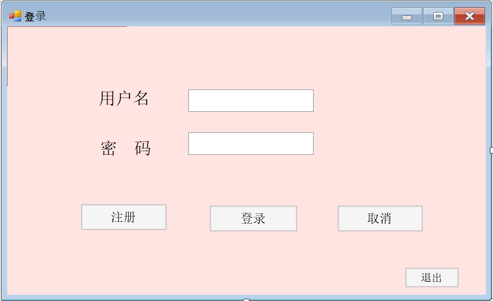
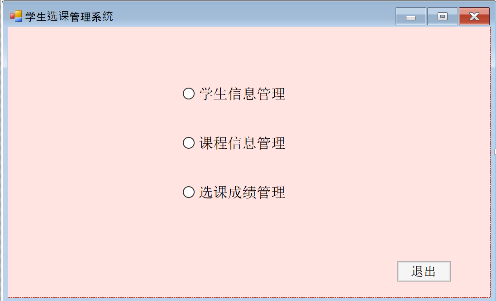
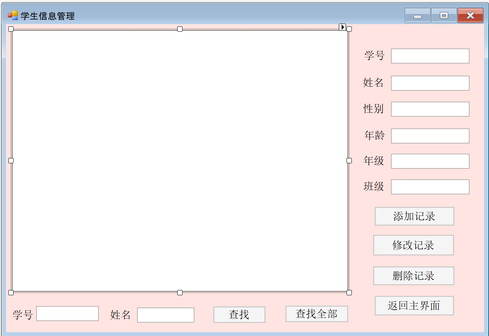
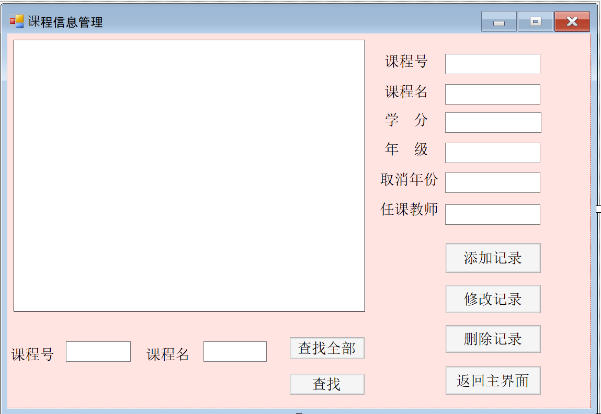
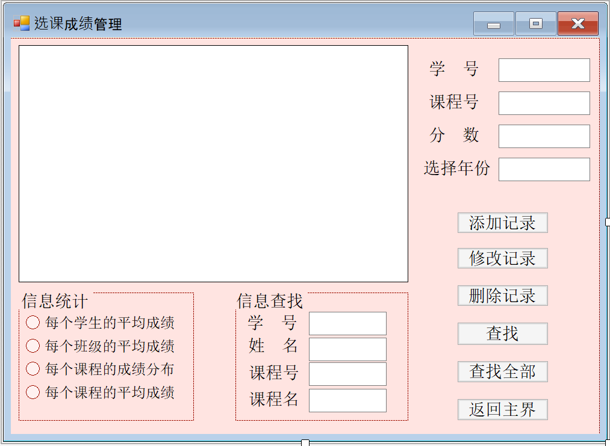

# 学生选课管理系统

该学生选课管理系统是我所修课程数据库的大作业设计作品；它实现了简单的学生注册登录，学生信息录入，选课和选课成绩管理的功能；但该项目最大的不足是没能够区分学生和管理员，所有的学生都能够对信息进行修改，这是老师对于我项目的缺点评价。因为当时我的水平有限，考虑的问题不够全面，设计的时候对于功能拓展性的问题没有进行考虑，导致了如果想要对该系统添加身份验证，以及对于不同学生显示不同视图的功能，需要对整个项目进行大改，花费的时间比重做整个项目还要多

虽然这个项目有缺陷，但也是花了我挺多时间的，中间也学习了很多东西，发现了自己很多不足之处；在此想要详细记录自己的项目总结，依次为戒，也算是自己学习的一个记录

## 功能要求

以下功能为概述性描述，具体的程序功能会在详细讲解中描述

1. 学生进入系统需要注册身份，登录系统后才能够进行下一步操作
2. 系统能够管理学生信息，学生录入信息包括学号，姓名，性别，年龄，年级，班级；其中学号只能为10位数字，性别为男或女，即系统需要对用户输入的学生信息进行检查是否符合输入要求；系统可以对学生进行增删改查操作，用户可以使用学生学号，姓名进行学生查询
3. 系统能够管理课程信息，即录入课程信息，修改课程信息，删除课程信息；课程信息包括课程号，课程名，学分，对应年级，取消年份，任课教师；系统可以对课程进行增删改查操作，用户可以使用课程号，课程名进行课程查询
4. 系统可以对学生的选课成绩进行管理，对学生的选课成绩进行增删改查操作，统计学生的平均成绩，每个班级的平均成绩，每个课程的成绩分布，每个课程的平均成绩

## 主要功能界面介绍

该项目使用C#完成，采用winForm的形式进行功能界面的设计，数据库使用mysql进行系统数据的存储，其中主要程序功能界面有四个：登录注册界面，用户主选择界面，学生信息管理界面，课程信息管理界面，选课成绩管理界面；每个界面都有数据库对象变量并保存其对象状态；界面中所有控件可以随窗口的缩放比例自动调整大小

### 登录注册界面--login.cs

界面效果图如下：



界面中分别对“注册”，“登录”，“取消”，“退出”按钮进行了事件函数绑定

**1.连接数据库--login_Load()**<br>
login界面加载时进行数据库连接事件处理，连接配置字符串如下,将其中user和password换成自己相应的用户名和密码即可连接mysql数据库;别忘了在mysql中建立数据库course_select_system,相应的数据表格名称参见页面代码

```
string s = "server=localhost;user=yourusername;password=yourpassword;" +
                "database=course_select_system;sslMode=none;";
```

**2.注册事件--register_Click()**<br>
注册时系统对数据库进行用户信息插入，系统将对信息文本框进行非空检查，并显示注册成功

**3.登录事件--yes_Click()**<br>
系统将对数据中用户信息表进行用户查询并匹配当前输入用户信息，若没有匹配结果，系统提示用户信息输入错误，若匹配成功，转到用户主选择界面user_page

**4.取消事件--no_Click()**<br>
用户点击取消按钮，“用户名”，“密码”文本框中信息清空

**5.退出事件--exit_Click()**<br>
用户点击退出按钮，系统弹出提示框“退出学生选课管理系统”，并尝试关闭数据库连接

### 用户主选择界面--user_page.cs

界面效果图如下：



用户可在该界面选择进入“学生信息管理”，“课程信息管理”，“选课成绩管理”页面，或者退出程序

### 学生信息管理页面--student_info.cs

界面效果如下：



该界面中可以对学生信息进行添加，修改，删除和查找的操作

**1.检查信息是否合法--validate()**<br>
大作业中要求学号只能是10位数，年龄在10~50之间，该函数对用户输入的信息进行合法性
检查，当输入信息不符合要求时，系统弹出提示框提示用户输入正确格式的信息

**2.添加记录--add_Click()**<br>
用户点击该按钮，系统首先对输入信息进行合法性检查；信息格式合法时进行数据库信息录入操作

**3.修改记录--update_Click()**<br>
因为之前水平有限，脑子有抽，完全没有考虑到信息修改的简便性和选择性，这个暂且不谈，说多都是泪（菜鸡的我。。。）；修改学生信息时，需要输入所有的信息，不管是需要修改的还是继续保持原来信息的都是需要输入的，当然你可以不输入，但这样系统会将原有的信息清空。。。(我知道自己的设计逻辑有问题，哭，我会尽我所能再重新写个比较理想的选课系统的，加油！！)

**4.删除记录--delete_Click()**<br>
删除记录时，用户只需要输入想要删除学生的学号即可进行信息删除；删除成功后系统弹出提示框记录删除成功

**5.显示记录信息--getMessage()**<br>
该函数使用sql语句对数据进行查询并将结果显示在窗口中

**6.查询信息--select_Click(), select_all_Click()**<br>
系统可进行两种查询形式；第一种是指定学生信息查询，用户可使用学生学号，或学生姓名，或者两者结合查询指定学生的信息；第二种是所有学生信息的查询，系统显示所有学生信息记录

### 课程信息管理页面--course_info.cs

界面效果如下：



课程信息管理界面可以对课程信息进行添加，修改，删除，查询的操作，操作逻辑与学生信息管理界面相同

**1.检查信息的合法性--validate()**<br>
课程信息中的课程号规定为7位数，所以系统需要对课程信息进行合法性检查；当信息格式不正确时，系统提示用户输入正确格式的课程号

**2.添加记录--add_Click()**<br>
用户点击该按钮，系统首先对输入信息进行合法性检查；信息格式合法时进行数据库信息录入操作

**3.修改记录--update_Click()**<br>
对课程信息进行修改的逻辑与学生信息修改的逻辑相同无异

**4.删除记录--delete_Click()**<br>
用户通过课程号的输入对该课程进行删除操作

**5.查询记录--select_Click(), selece_all_Click()**<br>
系统可以对课程进行两种形式的查询；第一种是指定课程信息查询，用户可以使用课程号，或者使用课程名，或者两者结合起来对指定课程进行查询；第二种是所有课程信息的查询，系统显示所有的课程信息

### 选课成绩管理页面--info.cs

界面效果如下：



该界面提供学生的选课信息信息添加，修改，删除，查找的功能，同时也提供了简单的信息统计功能；其添加，修改，删除功能与学生管理页面设计原理类似，在此不做过多介绍

**1.检查学生选课合法性--TrueYear()**<br>
大作业要求学生进行选课时只能选择与自己年级相符合的课程，其中课程的年级开设信息和学生的所属年级信息需一致，学生的选课请求才是合法的；该函数判断学生的选课是否符合选课要求

**信息统计**

此界面提供了简单的额信息统计功能，分别为“每个学生的平均成绩”，“每个班级的平均成绩”，“每个课程的成绩分布”，“每个课程的平均成绩”；用户点击信息统计功能中的check按钮，系统将显示相应的信息

**每个学生的平均成绩--average_mark_CheckedChanged()**<br>
学生的平均成绩为加权平均成绩，通过设计sql语句的逻辑，对每个学生所有的选修课成绩进行绩点和成绩的加权运算，并最终显示于窗口中

**每个班级的平均成绩--c_average_mark_CheckedChanged()**<br>
每个班级按照选修课程对班级中选择该课程的学生进行平均分计算

**每个课程的平均成绩--cou_average_mark_CheckedChanged()**<br>
按照课程进行分类，对该课程中所有选修的同学进行成绩统计

**每个课程的成绩分布--cou_mark_CheckedChanged()**<br>
按照课程进行分类，每个课程显示不同成绩段选修学生个数；成绩段分为100，90~99，
80~89，70~79，60~69，60以下

### 控件自适应类--AutoSizeForm.cs

为了让界面中所有的控件随着窗口的缩放同比例放大或缩小，使得用户体验感友好，本项目
编写了自适应类，每个界面都维护一个自适应类，用于调整界面控件大小，为每个界面的sizeChanged事件绑定处理函数，调用自适应类相应的功能函数，完成界面控件的自适应；该自适应类的设计逻辑请参考源文件（包含了详细注释）
